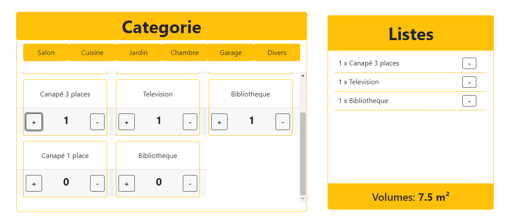

Module en REACT
Calculateur de Volume pour societé de demenagement.
le module permet de faire un trie par categorie, puis d'ajouter l'element dans la liste.
l'application calculera automatiquement le volume des elements de la liste.
le module contient les données en dur dans le fichier data, mais le code est prevu pour etre adapté en mode API

lien pour test (surge): http://free-jellyfish.surge.sh/ 

